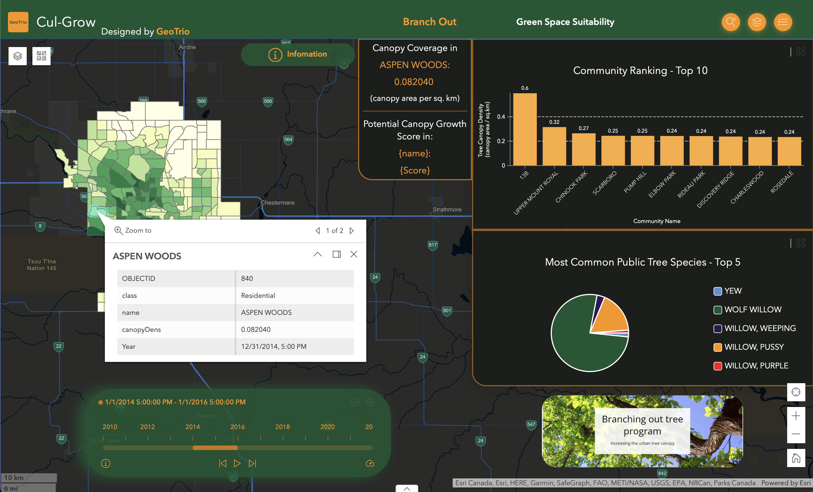
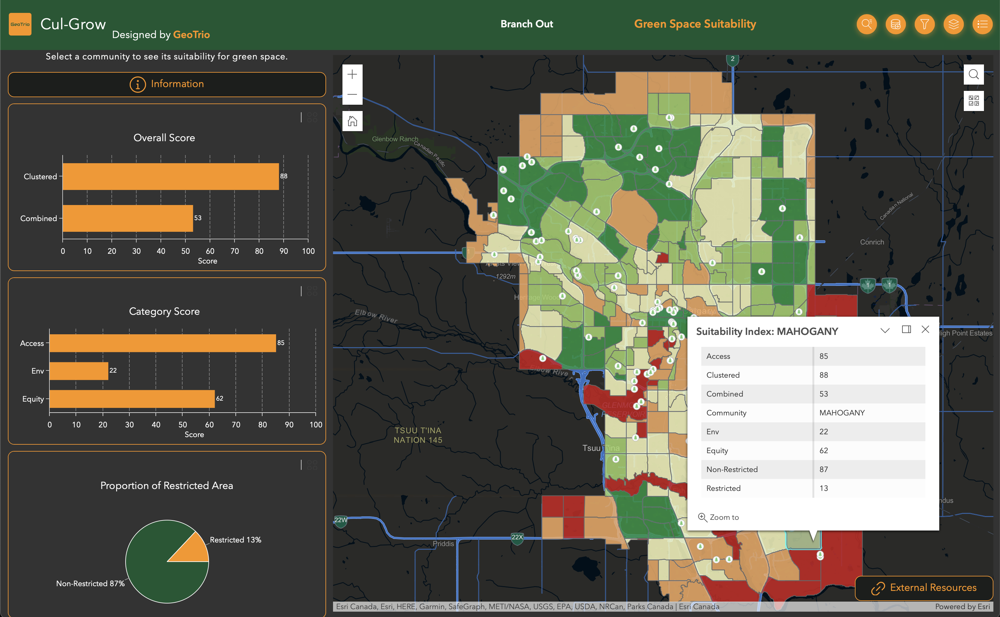

# *Cul-Grow* &mdash; Cultivating Growth in Calgary

A web app for analyzing the suitability of areas in Calgary for green space development, and raising awareness for the diminishing greenery in our city.  Visit [Cul-Grow](https://experience.arcgis.com/experience/faa11e97b9a74cf5b5a54123e1ddebd4), our [project website](https://google.com), or learn more about our motivations and methodology in our interactive [story map](https://storymaps.arcgis.com/stories/de95eb6e007642089686dc1c0b2bd677).

# Mission Statement

As of 2021, over 73% Canadians lived in large urban centers, and this number is continuing to grow [1]. However, a recent Statistics Canada study [2] showed that urban greenness decreased in nearly every major urban center in Canada in the previous decade.  In particular, Calgary’s urban greenness reduced from 56% in 2011 to only 42% in 2019, and Calgary now ranks with the second lowest urban greenness score out of all large urban centers in Canada at a mere 37.6% [3].

Urban green space provides numerous crucial benefits to the environment and the quality of life of citizens.  The increase in vegetation density that green spaces provide can improve urban air quality and mitigate the effects of urban heat islands by functioning as an air conditioning system, cooling the environment and balancing temperatures [4].  Green spaces also provide habitat to wildlife and increase connectivity of habitats that have been left fragmented by urbanization.  This improves urban biodiversity and reduces conflict between humans and wildlife.  Moreover, green spaces provide substantial improvements to the urban drainage system by increasing the prevalence of pervious landscapes and improving water storage capacity of the soil.  This aids in reducing stormwater runoff and helps protect urban areas against flooding [5].  Finally, especially among children and young adults, access to nature has been shown to improve mental health, reduce stress, and improve cognitive function, leading to healthier and happier communities [6].  As such, increasing urban green space is vital to the health of our urban environments and the communities in which we live.

In response to the destruction of natural landscapes and habitats in and around the City of Calgary, our team, the *GeoTrio*, has developed an application called ***Cul-Grow*** to help address the problem of diminishing green space.  Cul-Grow aims to promote the development of urban green spaces, raise awareness for the need for increased green space in Calgary, and highlight the importance of nature within our communities.  We aspire to progress Canadian urban centers towards the United Nations Sustainable Development Goal 11 target 11.7: “By 2030, provide universal access to safe, inclusive and accessible, green and public spaces…” [7].  We do so by providing a tool for decision makers to view and score potential locations for new public green spaces based on sociological and environmental factors.  Moreover, we aim to communicate the importance for green space development by providing a visual analysis of the reduction in greenness that has occurred in Calgary in the 21st century.

# Motivation

Nestled in the foothills of the Rocky Mountains, Calgarians take immense pride in the City's reputation for outdoor recreation. In recent years, the city has witnessed an unprecedented surge in population growth, and with it, an expansion of urban development. One of the unfortunate repercussions of this has been the proliferation of artificial structures and impervious surfaces, turning Calgary into a concrete jungle with the lowest levels of urban greenery among Canada's top five most populous cities. Statistics Canada reported a 20% loss of green space in Calgary between 2011 and 2023 [2], serving as a poignant reminder of how human activity can irrevocably damage natural landscapes and habitats.

Urban green space refers to any land within an urban area that is covered by vegetation such as trees, plants, gardens, or parks. It provides a multitude of ecological, social, and economic benefits to the community, and facilitates the interactions between living organisms and their physical and social environment.

To address the loss of green spaces and natural landscapes in Calgary, Team GeoTrio at the University of Calgary developed an application, [Cul-Grow](https://experience.arcgis.com/experience/faa11e97b9a74cf5b5a54123e1ddebd4), using ESRI technology to promote the Cultivation and Growth of green spaces and natural areas within the city. The application offers tools to highlight and examine the evolution of green space over the past five years. As well, the application provides practitioners and decision makers with functionality to identify suitable locations for new green spaces and evaluate existing development permits that promote the growth of greenspaces with the goal of highlighting the importance of nature within our communities.

To read more about our motivations and methodology, and to see interactive visualizations of the environmental degradation occurring in Calgary, visit our [story map](https://storymaps.arcgis.com/stories/de95eb6e007642089686dc1c0b2bd677).

# Features and Usage

Cul-Grow is split into two main functions: raising awareness for the reduction in tree canopy cover occurring in Calgary, and providing urban planners with a tool for assessing the suitability of various locations in Calgary or green space development.

## Branch Out

Our homepage, shown above, is called *Branch Out*, alluding to our mission of raising awareness for and increasing greenery in Calgary.  The main purpose of this page is to communicate the reduction in tree canopy coverage over the past decade, provide a potential tree growth score for each community, and promote the [Branching Out tree program](https://www.calgary.ca/parks-rec-programs/nature/tree-giveaway.html), a program devoted to increasing tree coverage in Calgary.  Information about the page and instructions for use can be viewed by clicking the green information button.

### Map

When the user enters the page, the default map layer shows the tree canopy density in each of Calgary's commnities.  By clicking play on the green timeline widget, the map dynamically updates to show the evolution and reduction in the the tree canopy coverage over the past decade.  When a community is clicked on the map, the tree canopy density will display in the canopy coverage widget located in the top right of the map.

### Charts

The bar chart in the top right of the page displays the top 10 communities with the highest tree canopy density for the currently selected year.  In particular, notice how community 13B has a very high tree canopy density prior to 2017, and then suddenly disappears from the top 10 in the following years.  This is one of many examples of habitat destruction highlighted by our analysis.

The pie chart shows the top 5 most common tree species currently in Calgary.  The most common species, the Wolf Willow, is a sun-loving shrub known for its silvery green foliage, and is native to western Canada.  It provides a food source for moose, elk, and several bird species, and the shrubs provide good cover and protection for moose, deer, birds, and other animals.

### Branching Out Tree Program

The [Branching Out tree program](https://www.calgary.ca/parks-rec-programs/nature/tree-giveaway.html) is a program by the city of Calgary focussing on the city’s current and future tree canopy.  As stated on the program's webpage, “Calgary’s tree canopy coverage is currently at 8.25%, this includes trees planted on both public and private property.”  To visualize the current tree coverage, our map includes a dataset containing all public tree locations citywide to allow users to check the public trees in their community.  The goal of the Branching Out program is to increase the tree canopy coverage to at least 16% by supporting residents with information and assistance on planting trees in their neighbourhood, and providing free trees to Calgary residents.  Click the Branching Out tree program image below the charts to see more on their initiative.

### Potential Tree Growth Score

In efforts to support the planting of trees in Calgary, a custom potential tree growth index was developed by GeoTrio. The index aims to illustrate the potential to increase tree growth in each community based on the three parameters: existing public trees, the road network, and land use zoning. A score from 0 to 1 is assigned to each community, with 1 representing high potential for future tree growth, and zero representing low potential.  This tool allows city planners to see which areas are best suited to tree planting efforts.  

To view the tree growth index, select the Potential Canopy Growth Score layer via the layer selector icon in the top left corner of the map.  Make sure the other layers are hidden, and then click on a community to see its tree growth score.  The score appears directly below the canopy coverage widget.

### Habitat Destruction in Community 13B

As can be seen from our analysis, a drastic decrease in tree canopy density is observed in the community 13B between 2016 and 2018.  This land lies just south of the west end of Fish Creek Park.  By clicking the up arrow at the bottom middle of the page, a window appears showing before and after photos taken from Google Street Maps of the destruction of the forested land in community 13B.  What was once a thriving forest is now nothing more than muddy grassland.

## Green Space Suitability

The second main function of our application is the Green Space Suitability tool, accessible via the Green Space Suitability button in the application's header. This tool provides a score to each community, indicating its suitability for green space development, and serves as a tool for urban planners, developers, and anyone interested in developing green spaces in Calgary.  This custom index was designed to align with relevant community and provincial guidelines, and takes into account several factors related to access, equity, and the environment to provide two overall scores and three category scores for green space development.  The category scores are computed from 13 separate factors, some of which include bike, public transit, and vehicle access, population density, species at risk in the area, nearness to existing parks, and tree canopy density.  These three category scores are then added directly to obtain the Combined Score.  The Clustered Score utilizes a machine learning approach to provide a score to each community based on the category scores of existing parks.  The Clustered Score focuses more on aspects which are similar to existing parks, whereas the Combined Score directly utilizes our 13 criteria to provide a balanced measure of suitability.

### Map & Charts

The main map allows you to visualize the Combined Score of each of the communities in Calgary.  To view further details, click a community on the map.  The top two charts on the left side display the suitability metrics in graphical form for the selected community.  This allows the user to easily obtain suitability metrics for any community, and compare the suitability of communities for green space development across Calgary.

Some areas, such as key wildlife and biodiversity zones, habitats, riparian management zones, existing green spaces, and airports are unsuitable for new green space development.  As such, we consider these areas as restricted areas, meaning that development of new parks or recreational areas is not feasible in these regions.  The Proportion of Restricted Area chart presents the proportion of land within a community that is restricted area, and the proportion that is potentially suitable for new green space development.

### Existing Green Space Permits

The tree icons on the map show the locations of existing building permits issued by the City of Calgary for various green space projects such as parks, outdoor recreation areas, and community gardens.  By clicking on an icon, the user can view the type of permit and the scores associated with its location.  This layer allows decision makers to identify and prioritize top choices for new permits based on the combined, clustered, and the individual theme scores.  The filter widget available on the right side of the header provides the ability to focus only on permits with high overall or theme scores, allowing a user to quickly narrow down on the best candidates for their application.

### Extra Functionality

The widget panel on the right side of the header contains a few other widgets that supplement the Green Space Suitability page.  The Search widget allows the user to search for a community to quickly find and select it on the map, and the Add Data tool provides the ability to add custom layers to the map.  This way, decision makers can upload locations to the app to quickly and visually determine the associated suitability scores.  The existing layers as well as any added layers can be toggled on and off with the provided Layers tool.

Additionally, we have provided some links to external resources for the interested user to learn more about green spaces in and around Calgary, and explore some organizations devoted to promoting parks and the conservation of natural areas in Alberta and across Canada.  These links are accessible via the External Resources button at the bottom of the map.

# Open Data Sources

All data obtained for this project is open data provided by Canadian organizations.  The table below summarizes the data used and their source.

| Title | Source | Link |
| --- | --- | --- |
| Natural Areas | City of Calgary’s Open Data Portal | [:link:](https://data.calgary.ca/Environment/Natural-Areas/szzc-mugz) |
| Habitat | City of Calgary’s Open Data Portal | [:link:](https://data.calgary.ca/Environment/Habitat/7tax-5vsg) |
| Critical Habitat for Species at Risk National Dataset **(Is this the right one?)** | Government of Canada | [:link:](https://open.canada.ca/data/en/dataset/47caa405-be2b-4e9e-8f53-c478ade2ca74) |
| Hydrology **(Is this the right one?)** | City of Calgary’s Open Data Portal | [:link:](https://data.calgary.ca/Environment/Hydrology/47bt-eefd) |
| Riparian Management Zones | City of Calgary’s Open Data Portal | [:link:](https://data.calgary.ca/Environment/Riparian-Management-Zones/fyid-twcw) |
| Park Sites | City of Calgary’s Open Data Portal | [:link:](https://data.calgary.ca/Recreation-and-Culture/Parks-Sites/i9fu-gjqj) |
| Tree Canopy Coverage (2012 - 2020) | City of Calgary’s Open Data Portal | [:link:](https://data.calgary.ca/Environment/Tree-Canopy-coverage-map-2012-2020-/dg68-2qx3) |
| Public Trees | City of Calgary’s Open Data Portal | [:link:](https://data.calgary.ca/Environment/Public-Trees/tfs4-3wwa) |
| Digital Elevation Model (DEM) - ASCII 2M | City of Calgary’s Open Data Portal | [:link:](https://data.calgary.ca/Base-Maps/Digital-Elevation-Model-DEM-ASCII-2M/eink-tu9p) |
| Land Use Districts | City of Calgary’s Open Data Portal | [:link:](https://data.calgary.ca/Base-Maps/Land-Use-Districts/qe6k-p9nh) |
| City Boundary | City of Calgary’s Open Data Portal | [:link:](https://data.calgary.ca/Base-Maps/City-Boundary/erra-cqp9) |
| Community Boundaries | City of Calgary’s Open Data Portal | [:link:](https://data.calgary.ca/Base-Maps/Community-Boundaries-2011/j3yz-fb4u) |
| Census by Community 2019 | City of Calgary’s Open Data Portal | [:link:](https://data.calgary.ca/Demographics/Census-by-Community-2019/rkfr-buzb) |
| Street Centerline | City of Calgary’s Open Data Portal | [:link:](https://data.calgary.ca/Transportation-Transit/Street-Centreline/4dx8-rtm5) |
| Major Road Network | City of Calgary’s Open Data Portal | [:link:](https://data.calgary.ca/Transportation-Transit/Major-Road-Network/tqjs-vnhy) |
| Calgary Transit Stops | City of Calgary’s Open Data Portal | [:link:](https://data.calgary.ca/Transportation-Transit/Calgary-Transit-Stops/muzh-c9qc) |
| Calgary Bikeways | City of Calgary’s Open Data Portal | [:link:](https://data.calgary.ca/Transportation-Transit/Calgary-Bikeways/jjqk-9b73) |
| Park Pathways | City of Calgary’s Open Data Portal | [:link:](https://data.calgary.ca/Recreation-and-Culture/Parks-Pathways/qndb-27qm) |
| Pathway Connector Data | City of Calgary’s Open Data Portal | [:link:](https://data.calgary.ca/Recreation-and-Culture/Pathways-Connector-Data/6eun-p5zf) |
|  | City of Calgary’s Open Data Portal | [:link:]() |
|  | City of Calgary’s Open Data Portal | [:link:]() |
|  | City of Calgary’s Open Data Portal | [:link:]() |
|  | City of Calgary’s Open Data Portal | [:link:]() |
|  | City of Calgary’s Open Data Portal | [:link:]() |
|  | City of Calgary’s Open Data Portal | [:link:]() |

# Team Bio's

### Adam Smith

 Adam is currently a first-year master's student in the Department of Geomatics Engineering at the University of Calgary.  Adam completed his undergraduate degree in mathematical physics from the University of Alberta in 2020, and gained an interest in GIS after designing a route planning app to accomplish some athletic goals.  His current research is focused on integrating quantum computing approaches into geomatics, and he is excited to apply his experience in physics to advance geospatial computing with quantum technology.  Apart from academic and professional pursuits, Adam spends as much time as possible in the mountains of western Canada, either mountain running and climbing in the summer, or nordic and alpine skiing in the winter.  

### Zonghao(Wade) Zhang  

 Wade is a second-year Master of Science in Geomatics Engineering student at the University of Calgary. Wade completed his undergraduate degree in Geomatics (B.Sc) from the British Columbia Institute of Technology (BCIT) in 2018, which offered him the opportunity to learn and understand Geomatics from traditional land surveying to advanced technologies, such as drone mapping. Wade’s current research applies the Agent-Based Model (ABM) in transportation. The multiagent spatiotemporal simulation of autonomous vehicle fleet operation is under development by using the City of Toronto as the use case. Outside of academics, Wade loves reading Chinese poems and history, snowboarding in the resort and backcountry, hiking and archery. He also enjoys teaching snowboarding as a CASI snowboarding instructor. 

### Mark Empey  

 When he is not off exploring the Rocky Mountains, Mark can be found trying to keep his tropical plant collection alive or volunteering as a Group Leader for the GoGeomatics Calgary Chapter where he enjoys discussing all things geospatial over a cold beer. After working as a GIS consultant and Geomatics specialist for a number of years, Mark decided to pursue graduate studies and is now a first-year PhD student in the Department of Geomatics Engineering at the University of Calgary. Mark holds an MEng in Geomatics Engineering from the University of Calgary, along with a BSc (Hon.) in Geomatics and a BSc (Hon.) in Physical Geography from Carleton University, where his love for GIS first blossomed. Mark's research interests lie in the application of Geographic Information Systems and Spatial Data Science to address challenges in stormwater infrastructure resilience and environmental modeling. 

# References

[1] “Canada's large urban centres continue to grow and spread,” *Statistics Canada*, Feb. 2022. Available: <https://www150.statcan.gc.ca/n1/daily-quotidien/220209/dq220209b-eng.htm>

[2] N. Lantz, M. Grenier and J.Wang, “Urban greenness, 2001, 2011 and 2019,” *Statistics Canada*, Aug. 2021. Available: <https://www150.statcan.gc.ca/n1/en/pub/16-002-x/2021001/article/00002-eng.htm>

[3] “Census of Environment: Urban greenness, 2022,” *Statistics Canada*, Nov. 2022. Available: <https://www150.statcan.gc.ca/n1/daily-quotidien/221117/dq221117e-eng.htm>

[4] P. Hesslerová, J. Pokorný, H. Huryna, J. Seják, and V. Jirka, “The impacts of greenery on urban climate and the options for use of thermal data in urban areas,” *Progress in Planning*, vol. 159, May 2022. Available: <https://doi.org/10.1016/j.progress.2021.100545>

[5] E. Zimmermann, L. Bracalenti, R. Piacentini, and L. Inostroza, “Urban Flood Risk Reduction by Increasing Green Areas for Adaptation to Climate Change,” *Procedia Engineering*, vol. 161, pp. 2241-2246, 2016.  Available: <https://doi.org/10.1016/j.proeng.2016.08.822>

[6] S. Tillmann, D. Tobin, W. Avison, and J. Gilliland, “Mental health benefits of interactions with nature in children and teenagers: a systematic review,” *Epidemiology and Community Health*, vol. 72, no. 10, Sept. 2018. Available: <https://jech.bmj.com/content/72/10/958.abstract>

[7] “Goal 11: Sustainable Cities and communities,” *UNEP*. Available: https://www.unep.org/explore-topics/sustainable-development-goals/why-do-sustainable-development-goals-matter/goal-11

---

Made with :heart: by the *GeoTrio*.
